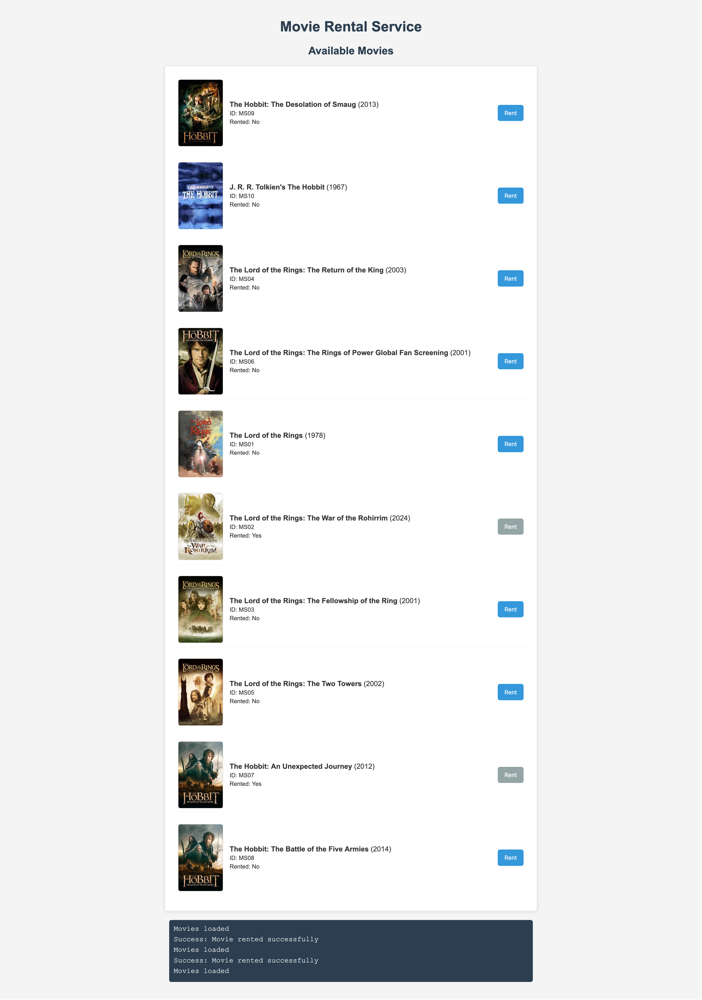

# Go Micro Tutorial: Movie Rental Service

## What is Go Micro?

**Micro** (often referred to as `go-micro`) is a microservices framework in Go designed for building scalable, distributed systems. Unlike Centrifuge, which focuses on real-time WebSocket communication, Micro provides tools for service discovery, client-side load balancing, and event streaming, making it ideal for creating small, independent services that communicate over a network. It’s lightweight, aligns with the microservices philosophy, and is well-suited for APIs or backend services, contrasting with full-stack frameworks that include more dependencies.

## Movie Rental Service

This project is a simple movie rental service built using Go Micro's web framework. It provides a RESTful API for listing movies and renting them. The client-side application allows users to interact with the service through a web interface.

### Screenshot



## Overview

This project showcases:

- Building a microservice with Go Micro's web framework
- Creating REST API endpoints
- Implementing a web client that consumes the microservice
- Basic CORS handling for cross-origin requests
- In-memory data storage with thread-safe operations

## Project Structure

```
.
├── client/
│   └── index.html     # Web client interface
├── go.mod             # Go module definition
├── go.sum             # Go module checksums
├── main.go            # Microservice implementation
└── README.md          # This documentation
```

## Prerequisites

- Go 1.24 or later
- Go Micro v5 (`go-micro.dev/v5`)

## Installation

1. Clone the repository or navigate to this directory

2. Install dependencies:

```bash
go mod tidy
```

## Running the Microservice

1. Start the microservice server:

```bash
go run main.go
```

The server will start on port 8800.

2. Open the client application:

Open the `client/index.html` file in your web browser. You can do this directly from the file system or serve it using a simple HTTP server.
```bash
cd client
python3 -m http.server 8000 --directory client
```

This will serve the client on port 8000.

## API Endpoints

### List Movies

- **URL**: `/movies`
- **Method**: GET
- **Response**: JSON array of movie objects
- **Example Response**:

```json
[
  {
    "id": "MS01",
    "title": "The Lord of the Rings",
    "release_year": 1978,
    "poster_url": "https://image.tmdb.org/t/p/w200/liW0mjvTyLs7UCumaHhx3PpU4VT.jpg",
    "is_rented": false
  },
  ...
]
```

### Rent a Movie

- **URL**: `/rent`
- **Method**: POST
- **Content-Type**: `application/json`
- **Request Body**:

```json
{
  "movie_id": "MS01"
}
```

- **Success Response**:

```json
{
  "message": "Movie rented successfully"
}
```

- **Error Responses**:
  - 400: Bad request (invalid JSON or missing movie_id)
  - 404: Movie not found
  - 409: Movie already rented

## Code Explanation

### Server-Side (main.go)

1. **Data Model**: The `Movie` struct defines the movie properties.

2. **RentalService**: Manages the in-memory movie database with thread-safe operations using a mutex.

3. **API Handlers**:
   - `ListMovies`: Returns all movies in the database
   - `RentMovie`: Updates a movie's rental status

4. **CORS Middleware**: The `withCORS` function adds necessary headers for cross-origin requests.

5. **Main Function**: Sets up the Go Micro web service and registers the HTTP handlers.

### Client-Side (index.html)

The client is a simple HTML/JavaScript application that:

1. Fetches and displays the list of available movies
2. Provides a button to rent movies
3. Updates the UI when a movie is rented
4. Includes a console-like output area for logging

## Key Concepts

### Go Micro Web Service

The application uses Go Micro's web service for HTTP handling:

```go
webService := web.NewService(
    web.Name("movie-rental.web"),
    web.Address(":8800"),
)
```

### Thread Safety

The application uses a mutex to ensure thread-safe operations on the shared movie database:

```go
type RentalService struct {
    movies map[string]*Movie
    mutex  sync.RWMutex
}
```

### CORS Handling

The application includes middleware to handle Cross-Origin Resource Sharing:

```go
func withCORS(handler http.HandlerFunc) http.HandlerFunc {
    return func(w http.ResponseWriter, r *http.Request) {
        w.Header().Set("Access-Control-Allow-Origin", "*")
        // Additional headers...
    }
}
```

### Run Application

## Extending the Application

Here are some ways you could extend this application:

1. Add persistent storage using a database
2. Implement user authentication
3. Add more API endpoints (return movies, search, etc.)
4. Implement service discovery with Go Micro
5. Add logging and monitoring

## Troubleshooting

- If you see CORS errors in the browser console, ensure the server is running and the CORS headers are being set correctly.
- If the client can't connect to the server, verify the server is running on port 8800 and there are no firewall issues.

## Resources

- [Go Micro Documentation](https://go-micro.dev/docs)